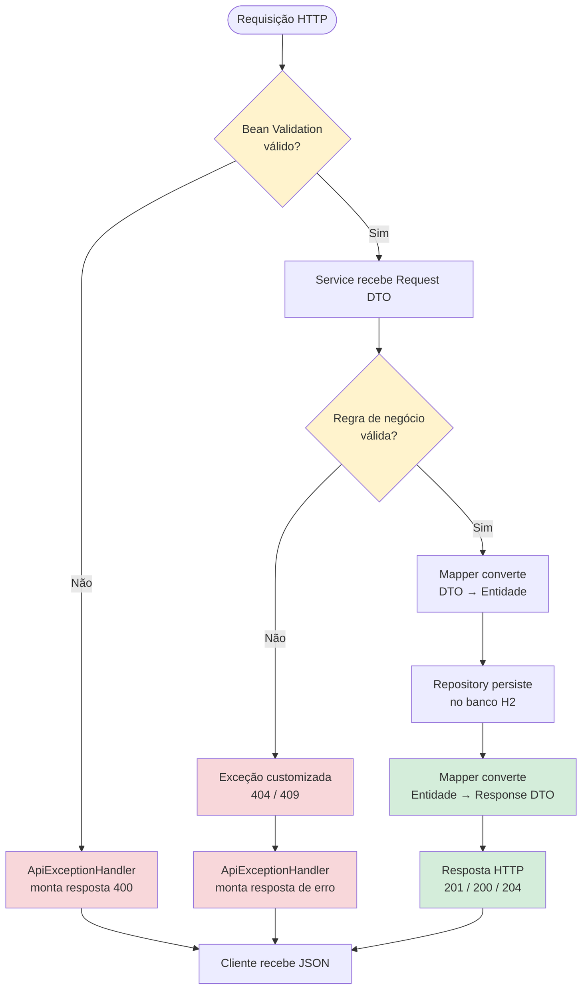
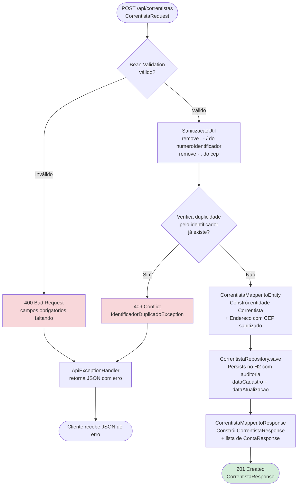
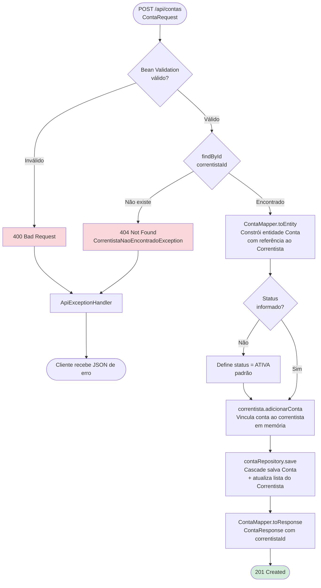
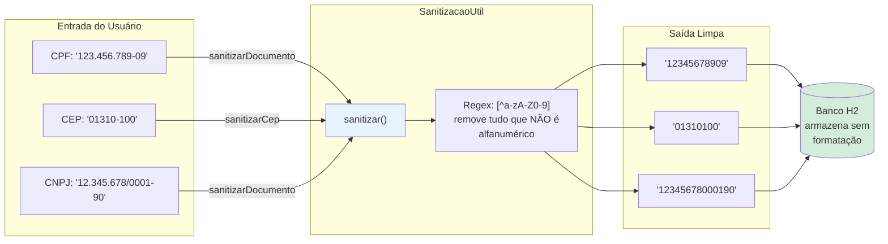
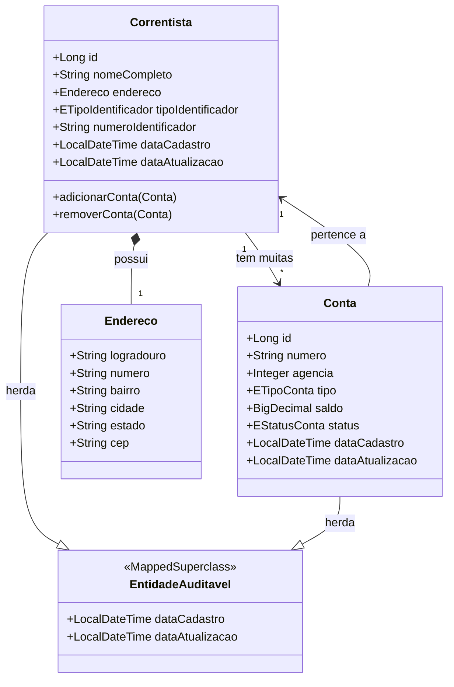

# Fluxogramas do Projeto

## 1. Arquitetura em Camadas

```mermaid
graph TB
    subgraph "Camada de Apresentação"
        CLIENT[Cliente HTTP<br/>Postman / Swagger UI / Frontend]
    end

    subgraph "Camada de Controller"
        CC[CorrentistaController<br/>/api/correntistas]
        CT[ContaController<br/>/api/contas]
    end

    subgraph "Camada de Validação"
        BV[Bean Validation<br/>@NotBlank, @NotNull, @Pattern]
        EXH[ApiExceptionHandler<br/>@RestControllerAdvice]
    end

    subgraph "Camada de Service"
        CS[CorrentistaService<br/>Regras de negócio]
        CTS[ContaService<br/>Regras de negócio]
    end

    subgraph "Camada de Mapper"
        CM[CorrentistaMapper<br/>DTO ↔ Entidade]
        CTM[ContaMapper<br/>DTO ↔ Entidade]
    end

    subgraph "Camada de Repository"
        CR[CorrentistaRepository<br/>Spring Data JPA]
        CTR[ContaRepository<br/>Spring Data JPA]
    end

    subgraph "Banco de Dados"
        H2[(H2 In-Memory<br/>geciaradb)]
    end

    subgraph "Utilitários"
        SU[SAnitizacaoUtil<br/>Remoção de caracteres especiais]
    end

    CLIENT --> CC
    CLIENT --> CT
    CC --> BV
    CT --> BV
    BV -->|Válido| CS
    BV -->|Inválido| EXH
    CS --> CM
    CS --> SU
    CTS --> CTM
    CM --> CR
    CTM --> CTR
    CR --> H2
    CTR --> H2
    CS -->|Exceção| EXH
    CTS -->|Exceção| EXH
    EXH --> CLIENT
```

---

## 2. Ciclo de Vida de uma Requisição



---

## 3. Cadastro de Correntista (POST /api/correntistas)



---

## 4. Atualização de Correntista (PUT /api/correntistas/{id})

```mermaid
flowchart TD
    START([PUT /api/correntistas/{id}<br/>CorrentistaAtualizacaoRequest]) --> FIND{findById no banco}

    FIND -->|Não existe| ERR404[404 Not Found<br/>CorrentistaNaoEncontradoException]
    FIND -->|Encontrado| NOME{nomeCompleto<br/>informado?}

    NOME -->|Sim| SET_N[correntista.setNomeCompleto]
    NOME -->|Não| END{endereco<br/>informado?}

    SET_N --> END

    END -->|Sim| SAN_CEP[SAnitizacaoUtil.sanitizarCep<br/>no CEP do endereco]
    SAN_CEP --> SET_E[correntista.setEndereco]
    END -->|Não| ID{tipoIdentificador E<br/>numeroIdentificador<br/>informados?}

    SET_E --> ID

    ID -->|Sim| SAN_DOC[SAnitizacaoUtil.sanitizarDocumento<br/>no numeroIdentificador]
    SAN_DOC --> SAME{Mesmo identificador<br/>já existente?}

    SAME -->|Sim| SET_ID[Atualiza identificador<br/>na entidade]
    SAME -->|Não| DUP{Verifica duplicidade<br/>pelo identificador<br/>já existe?}

    DUP -->|Sim| ERR409[409 Conflict<br/>IdentificadorDuplicadoException]
    DUP -->|Não| SET_ID

    SET_ID --> SAVE[Repository.save<br/>dataAtualizacao atualizada<br/>via @LastModifiedDate]
    ID -->|Não| SAVE

    SAVE --> RSP[Mapper.toResponse<br/>CorrentistaResponse]
    RSP --> OK([200 OK])

    ERR404 --> HANDLER[ApiExceptionHandler]
    ERR409 --> HANDLER
    HANDLER --> CLIENT([Cliente recebe JSON de erro])

    style ERR404 fill:#f8d7da
    style ERR409 fill:#f8d7da
    style OK fill:#d4edda
```

---

## 5. Exclusão de Correntista (DELETE /api/correntistas/{id})

```mermaid
flowchart TD
    START([DELETE /api/correntistas/{id}]) --> FIND{existsById<br/>no banco?}

    FIND -->|Não existe| ERR404[404 Not Found<br/>CorrentistaNaoEncontradoException]
    FIND -->|Existe| DEL[correntistaRepository.deleteById]

    DEL --> CASCADE[CascadeType.ALL<br/>+ orphanRemoval=true]
    CASCADE --> DEL_CONTAS[Hibernate DELETE FROM conta<br/>WHERE correntista_id = ?]
    DEL_CONTAS --> DEL_CORR[Hibernate DELETE FROM correntista<br/>WHERE id = ?]
    DEL_CORR --> OK([204 No Content])

    ERR404 --> HANDLER[ApiExceptionHandler]
    HANDLER --> CLIENT([Cliente recebe JSON de erro])

    style ERR404 fill:#f8d7da
    style OK fill:#d4edda
    style DEL_CONTAS fill:#fff3cd
    style DEL_CORR fill:#fff3cd
```

---

## 6. Cadastro de Conta (POST /api/contas)



---

## 7. Atualização de Conta (PUT /api/contas/{id})

```mermaid
flowchart TD
    START([PUT /api/contas/{id}<br/>ContaAtualizacaoRequest]) --> FIND{findById<br/>no banco}

    FIND -->|Não existe| ERR404[404 Not Found<br/>ContaNaoEncontradaException]
    FIND -->|Encontrado| NUM{numero<br/>informado?}

    NUM -->|Sim| SET_N[conta.setNumero]
    NUM -->|Não| AGE{agencia<br/>informada?}
    SET_N --> AGE

    AGE -->|Sim| SET_A[conta.setAgencia]
    AGE -->|Não| TIP{tipo<br/>informado?}
    SET_A --> TIP

    TIP -->|Sim| SET_T[conta.setTipo]
    TIP -->|Não| SAL{saldo<br/>informado?}
    SET_T --> SAL

    SAL -->|Sim| SET_S[conta.setSaldo]
    SAL -->|Não| SAVE
    SET_S --> SAVE[Repository.save<br/>dataAtualizacao atualizada<br/>via @LastModifiedDate]

    SAVE --> RSP[ContaMapper.toResponse]
    RSP --> OK([200 OK])

    ERR404 --> HANDLER[ApiExceptionHandler]
    HANDLER --> CLIENT([Cliente recebe JSON de erro])

    style ERR404 fill:#f8d7da
    style OK fill:#d4edda
```

---

## 8. Encerramento de Conta (DELETE /api/contas/{id})

```mermaid
flowchart TD
    START([DELETE /api/contas/{id}]) --> FIND{findById<br/>no banco}

    FIND -->|Não existe| ERR404[404 Not Found<br/>ContaNaoEncontradaException]
    FIND -->|Encontrado| SOFT[conta.setStatus<br/>= ENCERRADA]

    SOFT --> SAVE[Repository.save<br/>Apenas altera status<br/>registro NÃO é removido]
    SAVE --> OK([204 No Content<br/>Soft delete concluído])

    ERR404 --> HANDLER[ApiExceptionHandler]
    HANDLER --> CLIENT([Cliente recebe JSON de erro])

    style ERR404 fill:#f8d7da
    style OK fill:#d4edda
    style SOFT fill:#fff3cd
```

---

## 9. Tratamento de Exceções (ApiExceptionHandler)

```mermaid
flowchart TD
    EXC([Exceção lançada]) --> TYPE{Tipo da exceção}

    TYPE -->|CorrentistaNaoEncontradoException| NF404[404 Not Found<br/>"Correntista não encontrado"]
    TYPE -->|ContaNaoEncontradaException| NF404C[404 Not Found<br/>"Conta não encontrada"]
    TYPE -->|IdentificadorDuplicadoException| CON409[409 Conflict<br/>"Já existe correntista com este identificador"]
    TYPE -->|DataIntegrityViolationException| CON409D[409 Conflict<br/>"Violação de integridade"]
    TYPE -->|MethodArgumentNotValidException| VAL400[400 Bad Request<br/>campos inválidos detalhados]
    TYPE -->|Exception genérica| ERR500[500 Internal Server Error<br/>"Erro interno do servidor"]

    NF404 --> RESP[Response JSON:<br/>timestamp, status, erro, mensagem]
    NF404C --> RESP
    CON409 --> RESP
    CON409D --> RESP
    VAL400 --> RESP_V[Response JSON:<br/>timestamp, status, erro, detalhes]
    ERR500 --> RESP

    RESP --> CLIENT([Cliente])
    RESP_V --> CLIENT

    style NF404 fill:#fff3cd
    style NF404C fill:#fff3cd
    style CON409 fill:#f8d7da
    style CON409D fill:#f8d7da
    style VAL400 fill:#f8d7da
    style ERR500 fill:#f8d7da
```

---

## 10. Fluxo de Sanitização de Dados



---

## 11. Diagrama de Classes (Relacionamentos)


