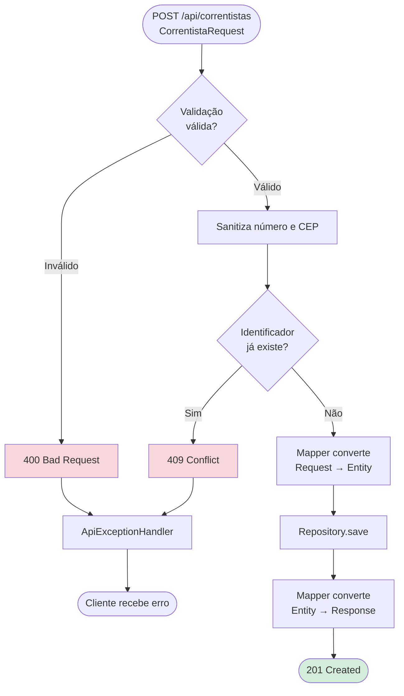
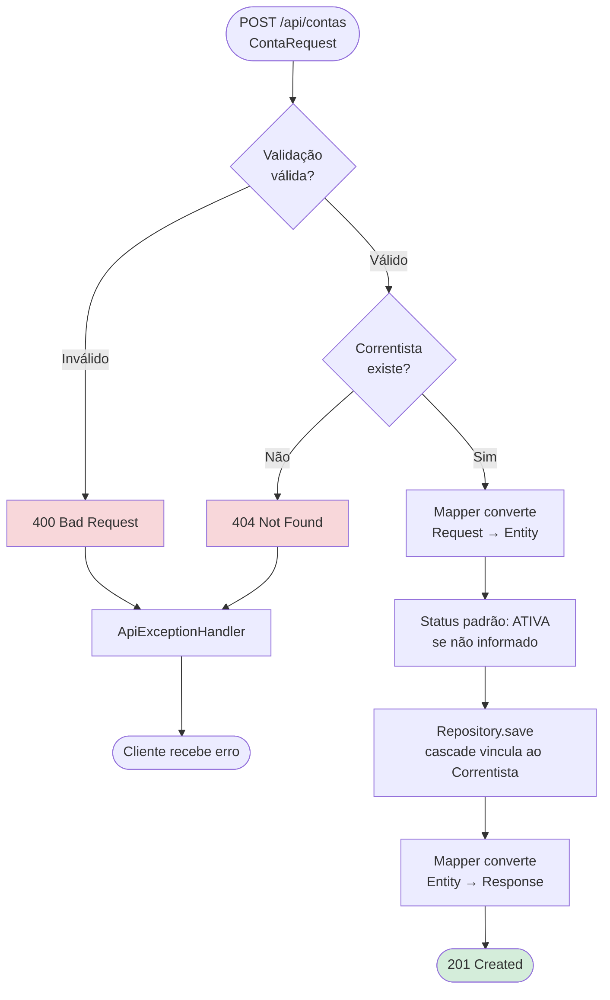
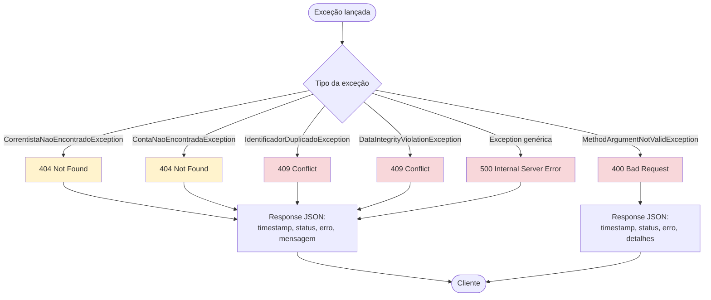
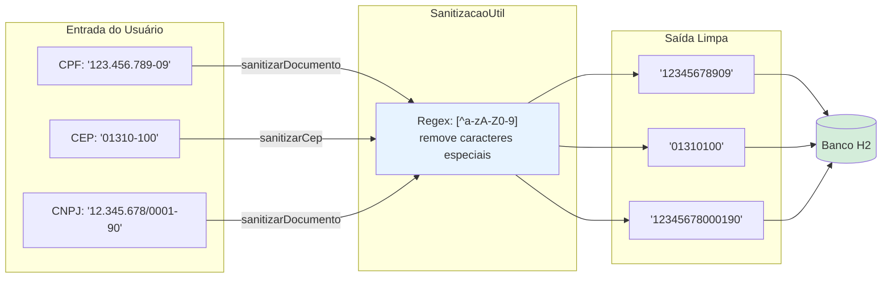
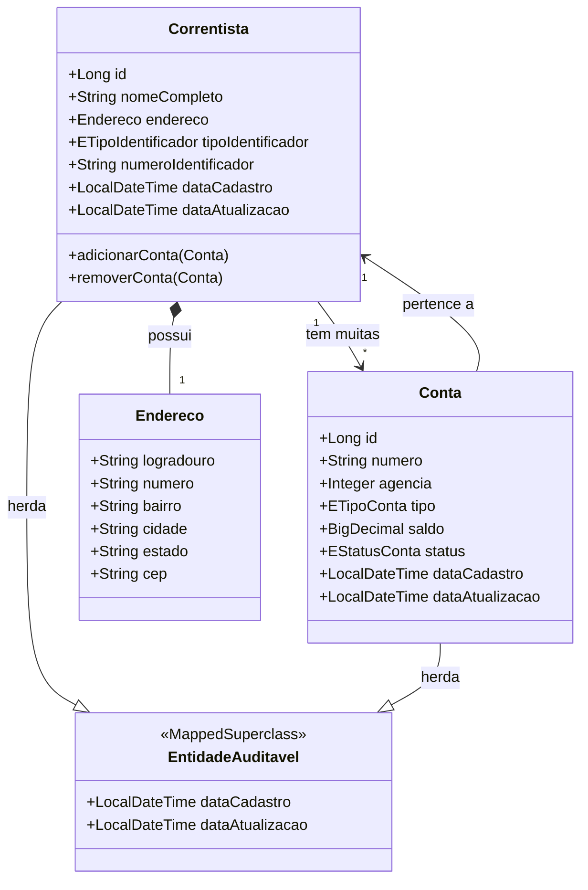
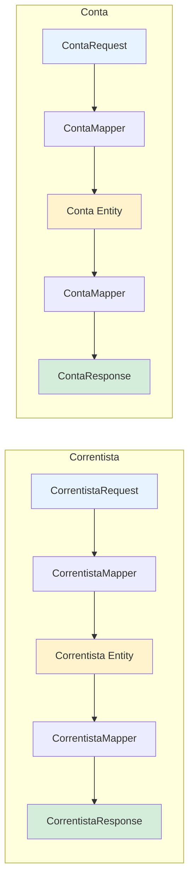

# Fluxogramas do Projeto

## 1. Arquitetura em Camadas

```mermaid
graph TB
    subgraph "Camada de Apresentação"
        CLIENT[Cliente HTTP<br/>Postman / Swagger UI / Frontend]
    end

    subgraph "Camada de Controller"
        CC[CorrentistaController<br/>/api/correntistas]
        CT[ContaController<br/>/api/contas]
    end

    subgraph "Camada de Validação"
        BV[Bean Validation<br/>@NotBlank, @NotNull, @Pattern]
        EXH[ApiExceptionHandler<br/>@RestControllerAdvice]
    end

    subgraph "Camada de Service"
        CS[CorrentistaService<br/>Regras de negócio]
        CTS[ContaService<br/>Regras de negócio]
    end

    subgraph "Camada de Mapper"
        CM[CorrentistaMapper<br/>DTO ↔ Entidade]
        CTM[ContaMapper<br/>DTO ↔ Entidade]
    end

    subgraph "Camada de Repository"
        CR[CorrentistaRepository<br/>Spring Data JPA]
        CTR[ContaRepository<br/>Spring Data JPA]
    end

    subgraph "Banco de Dados"
        H2[(H2 In-Memory<br/>geciaradb)]
    end

    subgraph "Utilitários"
        SU[SAnitizacaoUtil<br/>Remoção de caracteres especiais]
    end

    CLIENT --> CC
    CLIENT --> CT
    CC --> BV
    CT --> BV
    BV -->|Válido| CS
    BV -->|Válido| CTS
    BV -->|Inválido| EXH
    CS --> CM
    CTS --> CTM
    CS --> SU
    CM --> CR
    CTM --> CTR
    CR --> H2
    CTR --> H2
    CR --> CM
    CTR --> CTM
    CM --> CC
    CTM --> CT
    CC --> CLIENT
    CT --> CLIENT
    CS -->|Exceção| EXH
    CTS -->|Exceção| EXH
    EXH --> CLIENT
```

---

## 2. Ciclo de Vida de uma Requisição


---

## 3. Cadastro de Correntista (POST /api/correntistas)



---

## 4. Atualização de Correntista (PUT /api/correntistas/{id})

```mermaid
flowchart TD
    START([PUT /api/correntistas/{id}<br/>CorrentistaAtualizacaoRequest]) --> FIND{Correntista<br/>existe?}

    FIND -->|Não| ERR404[404 Not Found]
    FIND -->|Sim| UPD[Atualiza apenas<br/>campos enviados]

    UPD --> SAVE[Repository.save]
    SAVE --> RSP[Mapper converte<br/>Entity → Response]
    RSP --> OK([200 OK])

    ERR404 --> HANDLER[ApiExceptionHandler]
    HANDLER --> CLIENT([Cliente recebe erro])

    style ERR404 fill:#f8d7da
    style OK fill:#d4edda
```

---

## 5. Exclusão de Correntista (DELETE /api/correntistas/{id})

```mermaid
flowchart TD
    START([DELETE /api/correntistas/{id}]) --> FIND{Correntista<br/>existe?}

    FIND -->|Não| ERR404[404 Not Found]
    FIND -->|Sim| DEL[deleteById<br/>cascade remove contas]

    DEL --> OK([204 No Content])

    ERR404 --> HANDLER[ApiExceptionHandler]
    HANDLER --> CLIENT([Cliente recebe erro])

    style ERR404 fill:#f8d7da
    style OK fill:#d4edda
```

---

## 6. Cadastro de Conta (POST /api/contas)



---

## 7. Atualização de Conta (PUT /api/contas/{id})

```mermaid
flowchart TD
    START([PUT /api/contas/{id}<br/>ContaAtualizacaoRequest]) --> FIND{Conta<br/>existe?}

    FIND -->|Não| ERR404[404 Not Found]
    FIND -->|Sim| UPD[Atualiza apenas<br/>campos enviados]

    UPD --> SAVE[Repository.save]
    SAVE --> RSP[Mapper converte<br/>Entity → Response]
    RSP --> OK([200 OK])

    ERR404 --> HANDLER[ApiExceptionHandler]
    HANDLER --> CLIENT([Cliente recebe erro])

    style ERR404 fill:#f8d7da
    style OK fill:#d4edda
```

---

## 8. Encerramento de Conta (DELETE /api/contas/{id})

```mermaid
flowchart TD
    START([DELETE /api/contas/{id}]) --> FIND{Conta<br/>existe?}

    FIND -->|Não| ERR404[404 Not Found]
    FIND -->|Sim| SOFT[status = ENCERRADA<br/>soft delete]

    SOFT --> SAVE[Repository.save]
    SAVE --> OK([204 No Content])

    ERR404 --> HANDLER[ApiExceptionHandler]
    HANDLER --> CLIENT([Cliente recebe erro])

    style ERR404 fill:#f8d7da
    style OK fill:#d4edda
    style SOFT fill:#fff3cd
```

---

## 9. Tratamento de Exceções (ApiExceptionHandler)



---

## 10. Fluxo de Sanitização de Dados



---

## 11. Diagrama de Classes (Relacionamentos)



---

## 12. Fluxo de DTOs (Request → Entity → Response)


